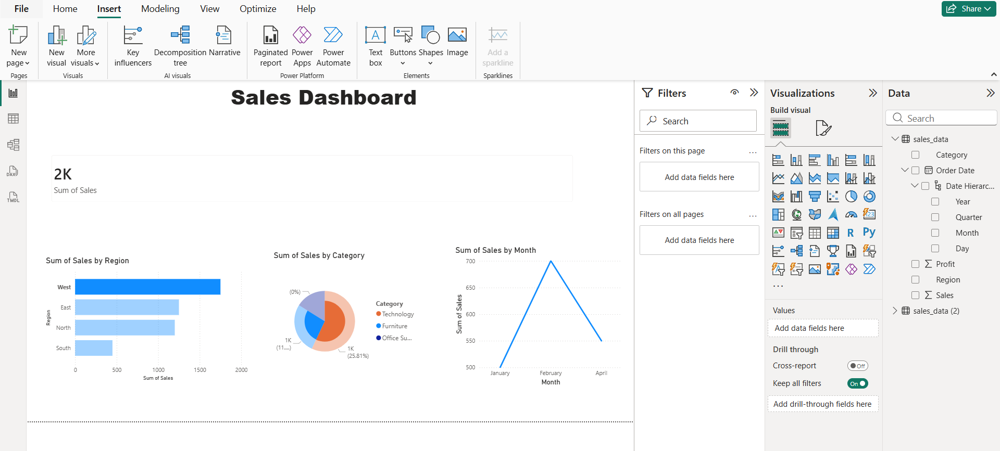

# 📊 Sales Data Analysis Dashboard

## 📖 Overview  
This project focuses on analyzing sales data to uncover trends, identify high-performing regions, and understand category-wise performance.

---

## 🛠 Tools & Technologies  
- Power BI  
- Excel  

---

## 📊 Key Insights  
- West region generated the highest sales  
- Technology category contributed the most revenue  
- Sales show variation across different months  

---

## 📈 Dashboard Features  
- KPI Cards (Total Sales)  
- Sales by Region (Bar Chart)  
- Sales by Category (Pie Chart)  
- Monthly Sales Trend (Line Chart)  

---

## 📸 Dashboard Preview  

---

## 🚀 What I Learned  
- Data visualization using Power BI  
- Identifying business insights from raw data  
- Creating interactive dashboards  

---

## 📌 Conclusion  
This project demonstrates my ability to analyze data and present insights effectively using visualization tools.
